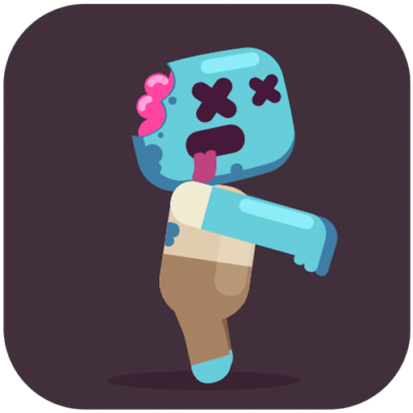
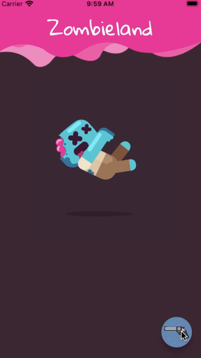

# Zombieland

</img>
Its a fun project. I thought - "Instead of a simple counter app, the
@FlutterDev team can provide a simple game like the one like this"

## Packages used:

</img>
// For playing audio files
[audioplayers: ^0.20.1](https://pub.dev/packages/audioplayers)
// For accessing google fonts
[google_fonts: ^2.2.0](https://pub.dev/packages/google_fonts)
// For controlling animated files(.riv)
[rive: ^0.8.1](https://pub.dev/packages/rive)
